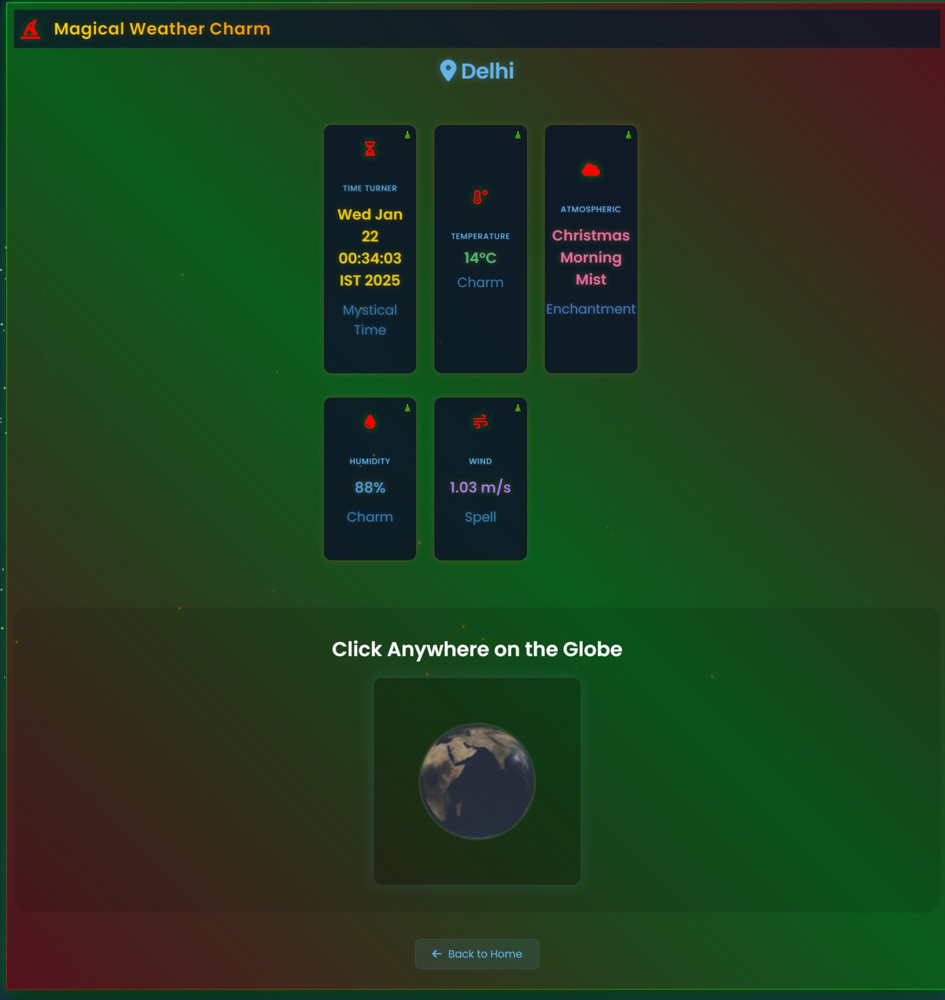

# **GayzyWeatherAppp4** 🌍🌦️

Welcome to **GayzyWeatherAppp4**, your futuristic, dynamic, and responsive 3D Earth model that lets you pinpoint any location across the globe and fetch real-time weather data! 💡🌐

## 💥 **Project Overview**

A sleek, **christmas-themed** interactive **3D Earth model** with a glowing interface, perfect for showcasing **real-time weather data** anywhere you need. 🌐✌️

### Features:
- **3D Earth**: Interactive globe with detailed textures and lighting effects.
- **Dynamic Weather Fetching**: Pinpoint any location on the Earth and get accurate, up-to-date weather data.
- **Fully Responsive**: Adaptive interface to work seamlessly on different screen sizes.
- **Cyberpunk UI**: Futuristic glowing UI with neon colors, offering an immersive experience.

## 🚀 **Project Screenshots**


*Interactive 3D Earth showing the dynamic weather updates.*


*Weather information popup with dynamic data.*

## 🌐 **Live Demo / Website**

Experience the project live here:  
[**GayzyWeatherAppp4 Live**](https://gayzy-weather-fiasco.wegic.app/)

## 📦 **Installation**

1. Clone the repository to your local machine:
    ```bash
    git clone https://github.com/OMENxSHREY/GayzyWeatherAppp4.git
    ```

2. Navigate into the project folder:
    ```bash
    cd GayzyWeatherAppp4
    ```

3. Install the necessary dependencies (if any):
    ```bash
    npm install  # or any other relevant command for your project
    ```

4. Run the app locally:
    ```bash
    npm start
    ```

5. Open your browser and go to `https://gayzy-weather-fiasco.wegic.app/` to experience the magic! ✨

## ⚡ **Tech Stack**
- **Frontend**: JavaScript (Three.js for 3D Earth model), HTML, CSS (Cyberpunk UI)
- **Backend**: Node.js / Express.js (for weather API integration)
- **Weather API**: OpenWeatherMap API for dynamic weather data

## 🛠 **Technologies Used**
- **Three.js** for 3D rendering
- **WebGL** for interactive 3D graphics
- **HTML/CSS** for the layout and style
- **JavaScript** for functionality
- **OpenWeatherMap API** for real-time weather data

## 🏄‍♂️ **Contribute**
Feel free to fork this repository, submit issues, and contribute. All contributors are welcome to add new features or improvements! 🌟

1. Fork the repository.
2. Create a new branch (`git checkout -b feature-name`).
3. Make your changes.
4. Commit your changes (`git commit -am 'Add feature'`).
5. Push to the branch (`git push origin feature-name`).
6. Create a new Pull Request.

## 🔒 **License**

This project is licensed under the MIT License - see the [LICENSE](LICENSE) file for details.

---

**Christmas Interface & Immersive UX Design 🔮** – *Built with passion for cutting-edge tech and weather enthusiasts who love style and functionality.* 🌈
